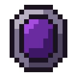
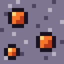
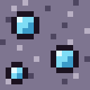

# Confluence texture style

The pack's own items and blocks (eight items, two ore blocks; `art/TEXTURES.md` says what each one is) share
one look: **bold modpack icons**. Dark outline, saturated fills, high contrast; they should read at a glance in
the questbook and stand out in a chest. Not vanilla-faithful on purpose (the maintainer's decision, D75 in the project's design log).

## Rules

1. **Canvas** 16×16, RGBA PNG, transparent background. No anti-aliasing, no gradients: every pixel is fully
   opaque or fully transparent. Save as 8-bit RGBA (convert the sprite to RGB colour mode with an alpha channel
   before exporting; no interlacing).
2. **Items** get a 1-px outline in `outline` around the whole silhouette, and the silhouette spans at least 12 px
   on one axis and 8 px on the other so the item reads in an inventory slot (the shards are 8×14, the coin
   12×12). Keep the outer 1-px border of the canvas empty (rows 0 and 15, columns 0 and 15) so the outline is
   never clipped by the slot.
3. **Blocks** (the two ores) have no outline around the block edge (they tile) and every pixel is opaque. The
   stone base has no outline; each fleck cluster has its own 1-px `outline` ring.
4. **Light from the top-left.** A texture's main material uses three shades of one ramp: light on top-left edges
   and highlights, base, dark on bottom-right edges and recesses. A secondary material (the catalyst's streams,
   an ore's flecks) may use two.
5. **Palette**: `art/palette.gpl` (GIMP palette format; most pixel editors import it). At most 32 colours; 26 are
   defined. Tuning a hue is fine (change the `.gpl` in the same PR), adding a 27th–32nd colour is fine, a
   texture that uses colours outside the palette is not.
6. **Families share a silhouette** so the set reads as one pack:
   - keys `twilight_key` / `other_key`: one key shape (ring bow, shaft, two teeth); green vs purple ramp.
      
   - foci `end_focus` / `astral_focus`: one octagonal gem in an octagonal neutral frame; dark purple vs gold gem.
      
   - shards `mercury_shard` / `glacio_shard`: one tall crystal; ember vs ice ramp.
      
   - ores `mercury_ore` / `glacio_ore`: one stone base (neutral ramp); ember vs ice flecks.
      
   - `coin`: a gold disc with one dark "C" in the centre, nothing else.
     
   - `confluence_catalyst`: the signature piece. Three streams (ice = tech, purple = magic, green = exploration)
     converge from the top corners and the bottom onto an ember core. The only texture with four ramps.
     

## Palette

| Ramp | light | base | dark | deep |
|---|---|---|---|---|
| outline | — | `#1B1220` | — | — |
| neutral | `#F2EEF5` (1) `#B9B0C4` (2) | `#7E7590` (3) | `#4E4660` (4) | `#2E2840` (5) |
| gold | `#FFF0A0` | `#F2B632` | `#B8741A` | `#6E4210` |
| green | `#B6F27A` | `#5BC24A` | `#2E8A3C` | `#1B5530` |
| purple | `#E2A6FF` | `#A54BE0` | `#6A2AA0` | `#3E1866` |
| ice | `#E4FBFF` | `#7EDCF5` | `#3A9BC9` | `#1F5C86` |
| ember | `#FFD27A` | `#F5762A` | `#B93A1A` | `#6E1E14` |

The stone base of the ores is neutral 2 / 3 / 4. Frames (the foci) are neutral 2 / 3 / 4 too.

## Where things are

- Textures: `kubejs/assets/kubejs/textures/item/<id>.png` and `.../block/<id>.png`. The PNG in the repo is
  canonical; `tools/gen_textures.py` only fills in missing files.
- Briefs, one per texture, with 8× renders: `art/TEXTURES.md`.
- How to contribute: `art/CONTRIBUTING.md`.
- The check every PR must pass: `python3 tools/check_textures.py`. It covers rule 1 and the mechanical halves
  of rules 2–3 (empty canvas border for items, fully opaque blocks); the outline ring, the silhouette size
  and the fleck rings are judged on the preview sheet.
